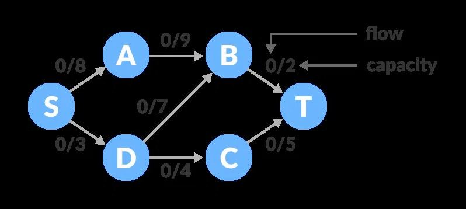
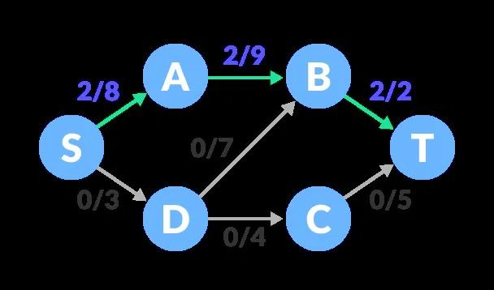
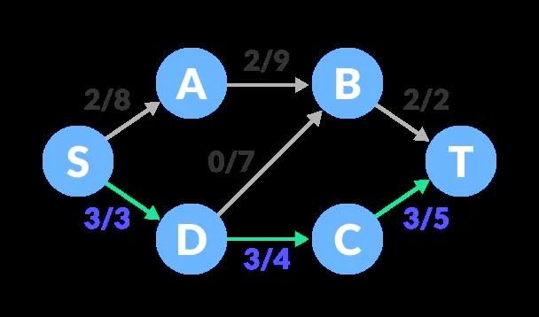

# Kuhn's Algorithm Visualization | Ford Falkerson

This repository contains a **Flask** application that demonstrates an **interactive visualization** of **Kuhn's algorithm** for finding a maximum matching in a bipartite graph.

---

## 1. Структура репозитория
```
kuhn_app/ 
├── app.py 
├── requirements.txt 
├── static/ 
│ ├── style.css 
│ └── script.js 
├── templates/ 
| ├── index.html 
| └── visualize.html 
└── README.md
```

## 2. Описание алгоритма (теория)

**Алгоритм Куна** предназначен для нахождения *максимального паросочетания* в двудольном графе.  
- Двудольный граф — это граф, вершины которого разбиты на два множества, \( X \) и \( Y \), причём каждое ребро соединяет вершину из \( X \) с вершиной из \( Y \).  
- *Паросочетание* в графе — набор рёбер, не имеющих общих вершин.  
- *Максимальное паросочетание* — паросочетание, которое нельзя увеличить добавлением ещё одного ребра (иначе нарушится условие, что никакие два рёбра не делят одну вершину).

Основная идея: алгоритм **последовательно** пытается найти для каждой вершины левой доли подходящую «парную» вершину в правой доле. Если вершина в правой доле уже занята, алгоритм пытается «сместить» занятую вершину через поиск *увеличивающего пути* (т. е. путь, чередующий рёбра внутри и вне текущего паросочетания).

## 3. Алгоритм

Пусть дан двудольный граф \( G = (X, Y, E) \) с \( |X|=n_1 \), \( |Y|=n_2 \).  
Пусть `adj[v]` — список вершин правой доли, смежных левой вершине \( v \).
```
for u in adj[v]:
    if matchR[u] == -1:
        matchR[u] = v
        return True
    else:
        v2 = matchR[u]
        if dfs(v2, used, matchR, adj) == True:
            matchR[u] = v
            return True

return False
```  
## 4. Запуск
Для запуска приложения необходимо:
```
git clone
cd mflow_kina
pip install -r requrements.txt
python app.py
```

## 5. Ford Falkerson
// T0D0 implement description and algorythm

 

 

 

 

// T0D3 implement Ford Falkerson into flask app

## license

OUTTATHE LICENSE

Copyright (c) [2025]